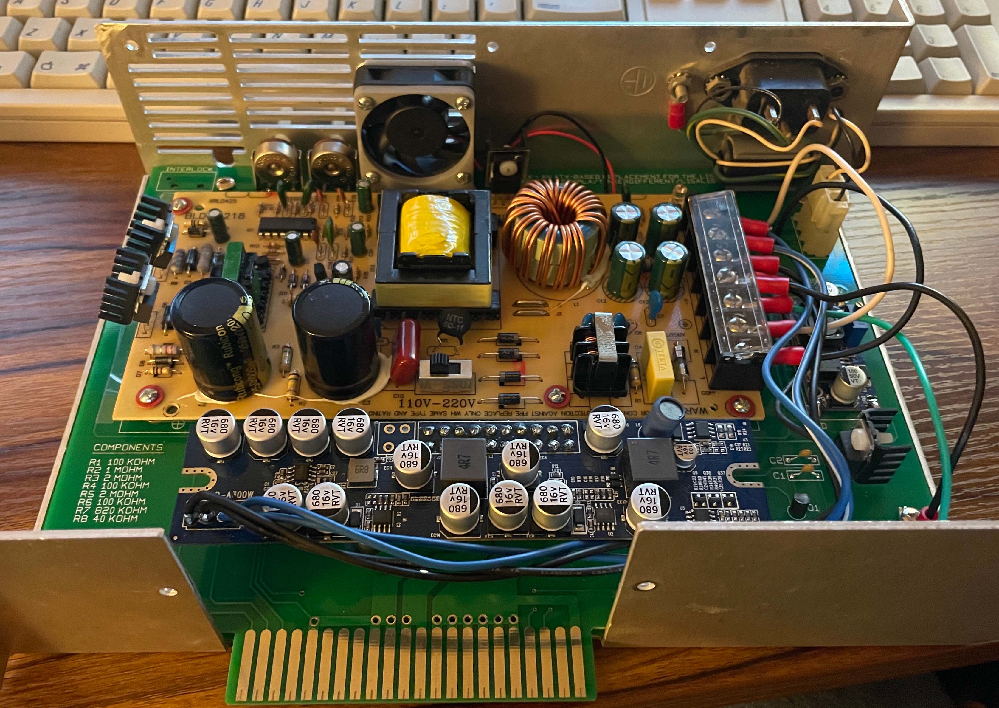
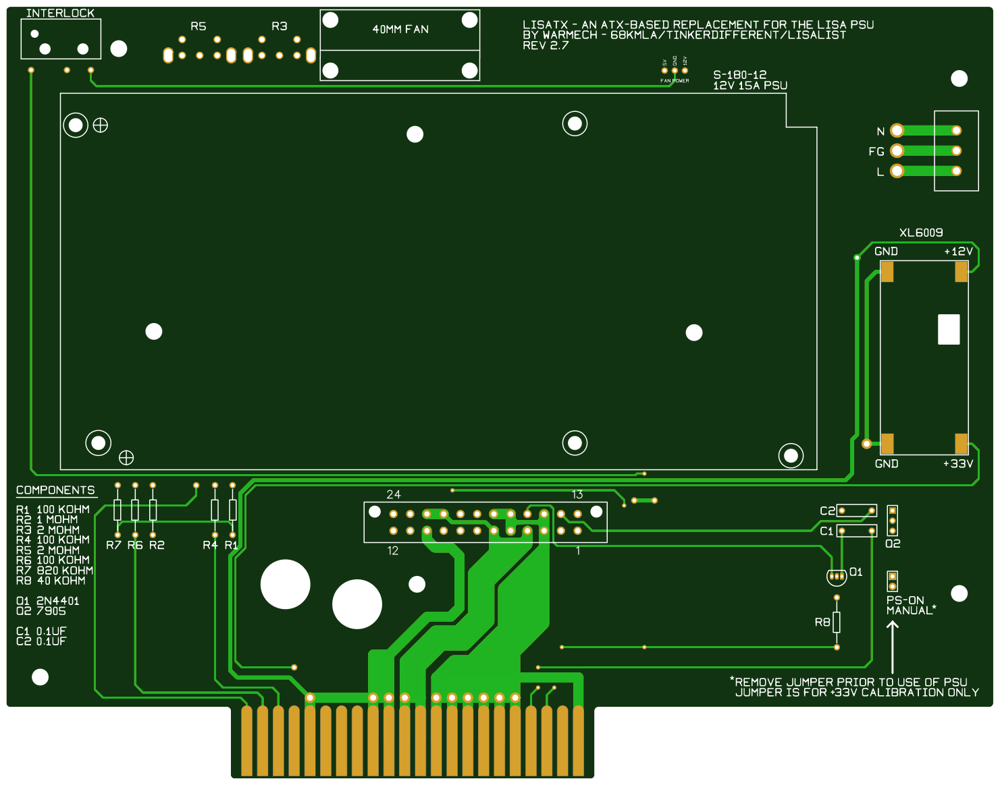
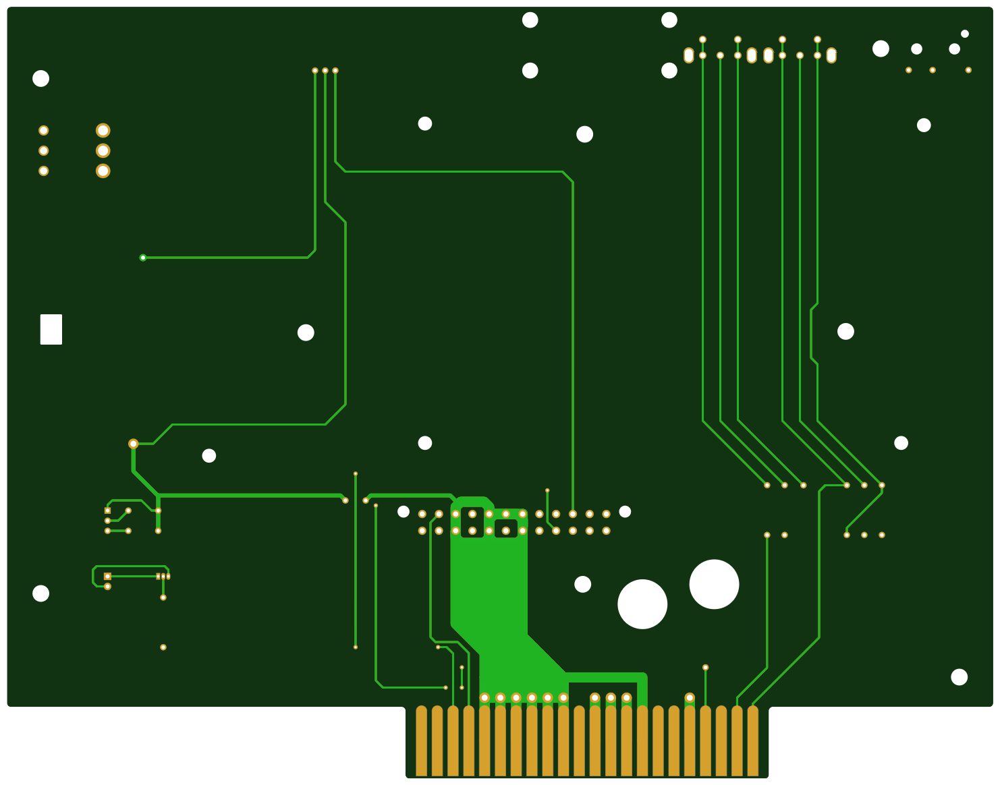

# Drop-In ATX PSU Replacement

This PCB aims to serve as a replacement for the aging 1.2A Lisa PSU and uses as many off the shelf components as possible; the three main components (the +12V primary PSU, the Pico ATX secondary PSU, and the buck-boost convertor for the +33V rail), for instance, are all easily obtained on Amazon. The original 1.2A power supply uses a number of components that are becoming increasingly difficult to obtain, namely:

- The solid state optoelectronic relay used to switch on power in the PSU (these are next to impossible to source at a reasonable price)
- The main transformer (which had failed in one of mine; as it is unique to the Lisa PSU, it's literally unobtainable unless scavenging from another 1.2A Lisa PSU)

The following components/parts are required and may be divided into two types: new components/parts and parts which may otherwise be recycled from an original PSU. The complete BOM is as follows (all resistors 1/4 watt):

- 1 - 12V 15A 180W Switching PSU - Multiple Manufacturers, Part No. S-180-12 ([Amazon](https://www.amazon.com/dp/B0B7CW3H2T))
- 1 - Pico ATX PSU - Multiple Manufacturers, Multiple Part Nos. - See note below - Example: ([Amazon](https://www.amazon.com/dp/B071P3HMNK))
- 1 - XL6009 Boost Convertor Module - Multiple Manufacturers, Multiple Part Nos. - Example: ([Amazon](https://www.amazon.com/dp/B07KBRWWQX))
- 1 - 2N4401 NPN Transistor (Q1) - Onsemi/Fairchild Semiconductor, Part No. 2N4401BU ([Mouser](https://www.mouser.com/ProductDetail/512-2N4401BU))
- 1 - 7905 Linear Voltage Regulator (Q2) - Onsemi, Part No. MC7905BTG ([Mouser](https://www.mouser.com/ProductDetail/863-MC7905BTG))
- 4 - TO-220 Rectangular Fin Heatsink - Wakefield-Vette, Part No. 274-1AB ([Mouser](https://www.mouser.com/ProductDetail/567-274-1AB))
- 4 - TO-220 Mica Thermally Conductive Gap Pad - Aavid, Part No. 56-77-8G ([Mouser](https://www.mouser.com/ProductDetail/532-56-77-8G))
- 4 - Nylon M3 x 0.5 x 8mm Phillips Screw - Essentra, Part No. 50M030050G008 ([Mouser](https://www.mouser.com/ProductDetail/144-50M030050G008))
- 4 - Nylon M3 Hex Nut - Essentra, Part No. 04M030050HNDIN34814 ([Mouser](https://www.mouser.com/ProductDetail/144-04M030050HNDIN34))
- 1 - 40mm x 40mm x 10mm DC Fan (12V or 5V)
- 3 - 100K Ohm Resistor (R1, R4, R6)
- 1 - 1M Ohm Resistor (R2)
- 2 - 2M Ohm Potentiometer (R3, R5)
- 1 - 820K Ohm Resistor (R7)
- 1 - 40K Ohm Resistor (R8)
- 2 - 0.1uF Ceramic Capacitor (C1, C2)
- 1 - Interlock Switch
- 1 - 3-Pin Molex Connector

Of the above components, R1-R7, Q2, the 3-Pin Molex connector, and the interlock switch may be recycled from a 1.2A Lisa PSU. If you plan on using the interlock switch, it is highly recommended that you recycle the one from your original PSU; this is due to the lack of comparable replacements that have the exact same form factor. The model linked to in the BOM is a close match, but is not intended for right angle mounting; regardless, it can be secured in place via the mounting holes and connected to the appropriate pads via wire jumpers. Additionally, unless you have Molex connector assembly tools, it is also recommended that you recycle the Molex power connector.

NOTE: When selecting a Pico ATX PSU, be mindful to select one whose output is capable of meeting the peak draw indicated in the Lisa Hardware Manual:

- +5V:  8A
- +12V  2A
- -12V  200mA
- +5VSB 100mA

Unfortunately, one of the major tasks is finding a PSU that is capable of outputting a decent amount of current on the -12V rail. Most Pico ATX PSUs peak at ~100mA on the -12V rail and, while the example above is capable of peaking at 200mA, it is still worrisome due to the fact that the -5V rail has to be derived from the -12V rail via linear voltage regulator. The linear regulation process unfortunately requires a current that causes the -12V rail on most Pico PSUs to either run very close to its peak or exceeds it wholesale.

# Assembly Instructions

The following instructions will guide you through the process of installing an ATX PSU into a Lisa PSU enclosure:

1. Begin by assembling all the discrete components, such as resistors, transistors, potentiometers, connectors, etc.

2. Once the discrete components have been installed, remove the +12V PSU from its metal housing. The S-180-12 PSU should have the same construction regardless of the manufacurer, so disassembly should be the same no matter which brand you buy. Be sure to retain the insulating plastic sheet.

3. Install the heatsinks on the four TO-220 transistors (the 7905 and the three other transistors on the 12V PSU), ensuring that you insert and evenly align the mica insulators between each heatsink and the back of each transistor.

4. Place the +12V PSU and its insulator sheet inside the corresponding outline on the replacement board and align the PSU using the holes on each PCB. Once aligned, insert spacers between each indicated fastener hole and attach the PSU using machine screws. Optimally, using short motherboard standoffs is recommended - it just looks cleaner and you don't have to source plastic or nylon spacers (or do as I've done countless times and crudley fashion your own from bits of plastic you find lying about).

5. Next, place the buck-boost PCB inside the XL6009 outline, making sure to align the proud solder pads with the rectangular cutout in the board. Once aligned, flow a large amount of solder on to each corner pad and solder the XL6009 unit down to the board.

6. Loosely insert the Pico ATX PSU into its connector (soldered down in step 1). Once inserted, measure the approximate distance between the power and ground connection on the Pico and their corresponding terminals on the S-180-12. Once measured, cut lengths of either 12 or 14 gauge wire that are slightly longer than the approximte length measured previously. Strip and tin one end of each wire; for the other end of each wire, strip the end and crimp an appropriately sized spade terminal that will fit the screw terminal on the S-180-12. Once the terminals have been affixed, solder the tinned ends into their corresponding pads on the Pico ATX PSU and then connect the spade terminals to their corresponding connections on the S-180-12 screw terminal. Firmly press the Pico to completely seat in in its connector.

7. Measure the approximate distance between the Live (L), Neutral (N), and Frame Ground (FG) pads next to the Molex power connector and their corresponding terminals on the S-180-12. Once measured, cut lengths of either 12 or 14 gauge wire that are slightly longer than the approximte length measured previously. Strip and tin one end of each wire; for the other end of each wire, strip the end and crimp an appropriately sized spade terminal that will fit the screw terminal on the S-180-12. Once the terminals have been affixed, solder the tinned ends into their corresponding AC input pads and then connect the spade terminals to their corresponding connections on the S-180-12 screw terminal.

8. Install the 40mm fan into the 3D-printed fan mount using #4-40 x 3/4" round head machine screws and nuts in their respective captive sockets. Ensure the air output side of the fan is facing the side of the mount with the #4-40 nuts. Once installed, attach the mount to the PCB with #4-40 x 3/8" round head machine screws and nuts in their respective captive slots. Ensure that the air output side of the fan is facing the case exterior. Once installed, solder the fan's power and ground wires to the appropriate connections to the right of the fan mount in the "Fan Power" pads.

9. Install the PSU into the Lisa PSU case and attach the IEC power connector to the Molex connector on the PCB. There will be some resistance when initially inserting the PCB due to the fan mount (if used) making contact with the case wall. A little give is okay and should not damage the mount. Once inserted, secure the PCB to the case using the visible screw posts.

10. Once secured, place a jumper on J1 and connect the PSU to an IEC power cable to turn the Pico ATX PSU on. Once on, use a multimeter and measure the voltage produced by the XL6009. If it is above or below +33V, use the potentiometer on the module to dial in the voltage. Once dialed in, unplug the PSU and remove the jumper from J1.

11. Once the jumper is removed from J1, screw the case back together to finish assembly. The PSU is now ready for use.